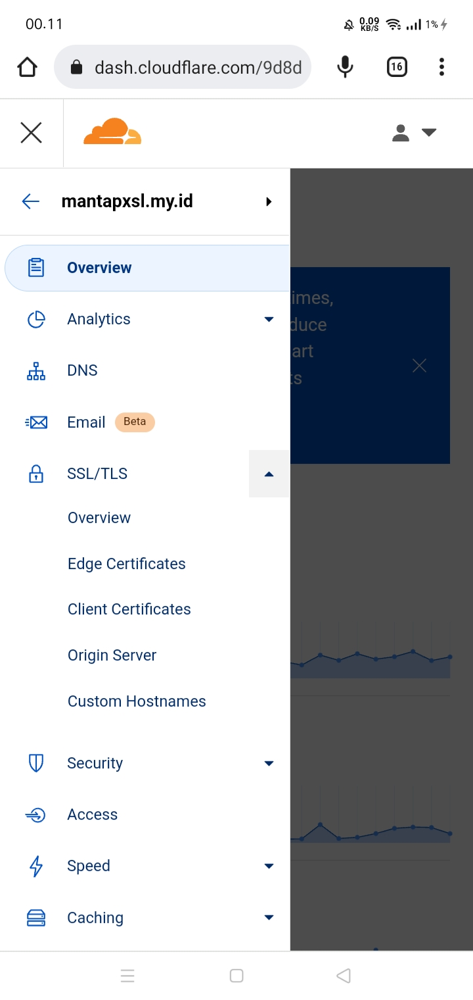
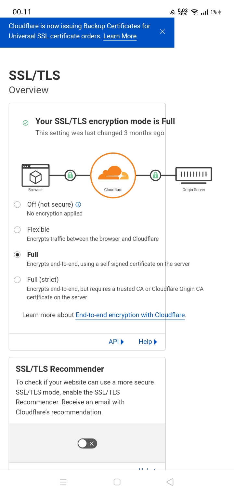
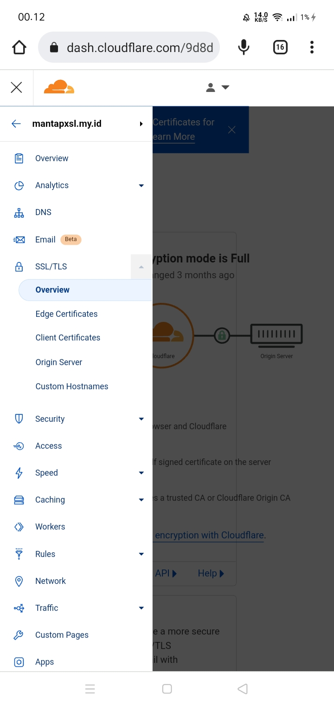
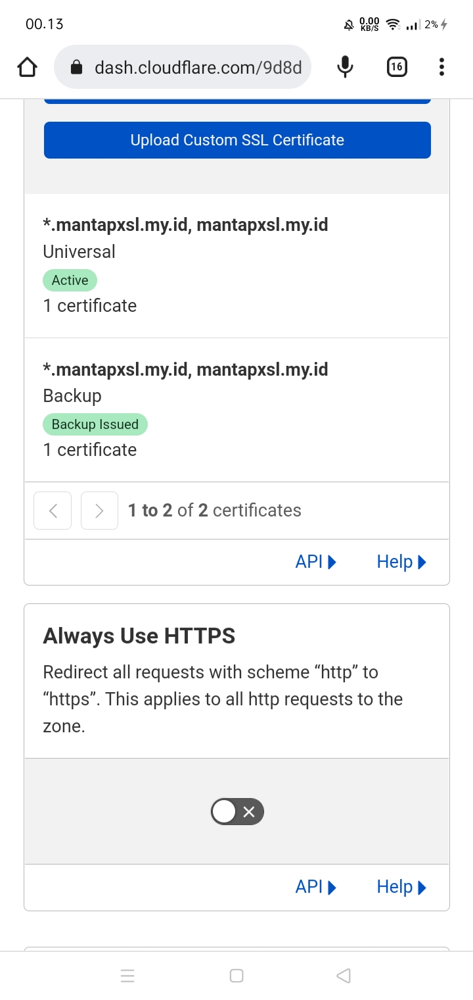
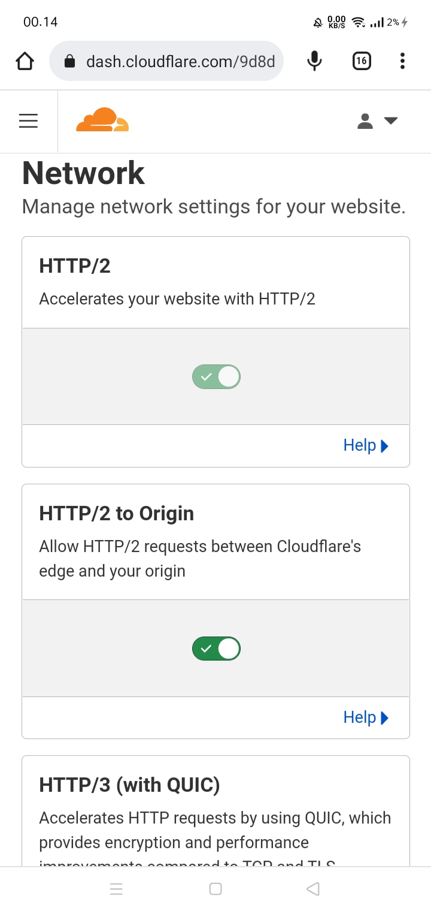
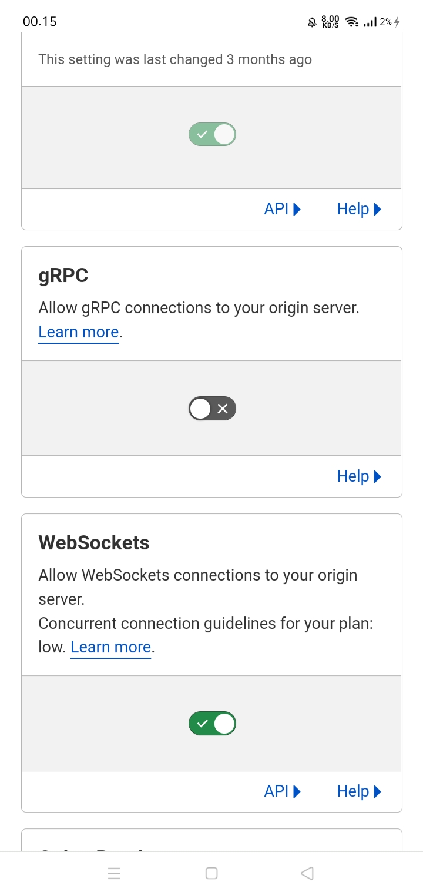

# XRAY - MULTI PORT
- ***Script XRAY Multi Port 443/80 MOD By VoltSSH***
- ***Original Script By SL***
- ***SCRIPT TO CREATE A VPN SERVER***
#

#  XRAY | TLS
- TROJAN WS        : **443**
- TROJAN GRPC      : **443**
- SHADOWSOCKS WS   : **443**
- SHADOWSOCKS GRPC : **443**
- VMESS WS         : **443**
- VMESS GRPC       : **443**
- VLESS WS         : **443**
- VLESS GRPC       : **443**
#
# FITUR XRAY HTTP
- TROJAN WS        : **80**
- TROJAN GRPC      : **80**
- SHADOWSOCKS WS   : **80**
- SHADOWSOCKS GRPC : **80**
- VMESS WS         : **80**
- VMESS GRPC       : **80**
- VLESS WS         : **80**
- VLESS GRPC       : **80**
#
# MOD List & Updated
- Menu Optimization
- Added Add Domain Before Install
- Separation of creation and deletion of each service account
- addition of active period / renew account
- fixed auto reboot 23:59 GTM +0
- Add auto expired
- etc

# OS
- Debian 9 (HVM)
- Debian 10
* Successfully used on AWS VPS and OS Debian 9 HVM
- Ubuntu 18.04/20.04(x86_64)
- Ubuntu (ARM/aarch64) ? Not Tested
* Not tested on other OS

# Terms && Materials To Use This Script
- Must Have VPS
- Must Have Cloudflare Account
- Must Have Your Own Domain
- *** If all the conditions and ingredients have been met, please try this script ***

# How to Install the Script
- Login to your VPS (must use user ***root***)
1. ENTER INTO VPS THEN TYPE
```
sudo su
```

2. Update the VPS first

```
apt-get update && apt-get upgrade -y && update-grub && sleep 2 && reboot
```
- Will Automatically Reboot / Restart

3. Login to vps

4. Copy the code below and paste it into your vps
- then the install process will run, don't leave the vps
- If you exit the VPS during the install process, it will fail
```
wget https://raw.githubusercontent.com/prjkt-nv404/XRAY-MULTI/main/setup.sh && chmod +x setup.sh && ./setup.sh
```
5. when finished, then type `menu` to display the menu

```
menu
```
7. DONE / FINISHED

#
# Fix / FIX info
- ***NOTE***
- if xray and nginx have an error !
- type
```
certxray
```
then type
```
restart-xray
```
#
# SCRIPT CODE INFO
- xmenu (to display the original menu)
- menu (to display the minified menu)
- updatedll (for sc updates)
- restart-xray (restart xray)
- certv2ray/certxray (Update Certificate / Update Certificate)

#
# CLOUDFLARE SETTINGS
<table>
  <tr>
   <tr>
      <td></td>
      <td></td>
   <tr>
      <td></td>
      <td></td> 
   </tr>
     <tr>
      <td></td>
      <td></td> 
  </tr>
  </tr>
</table>

*<u>NOTE</u>: the images are for reference only*
#